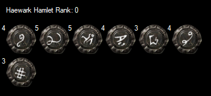

AHK tool to display all maps, with tier data, for a given rank in a specified atlas region.

Default controls:
Numpad Enter :: Show/Hide
Numpad+ :: Increase Region Rank
Numpad- :: Decrease Region Rank
Numpad/ :: Previous Region
Numpad* :: Next Region

Current region and region ranks are current not saved and will reset to defaults the next time the program is run.

